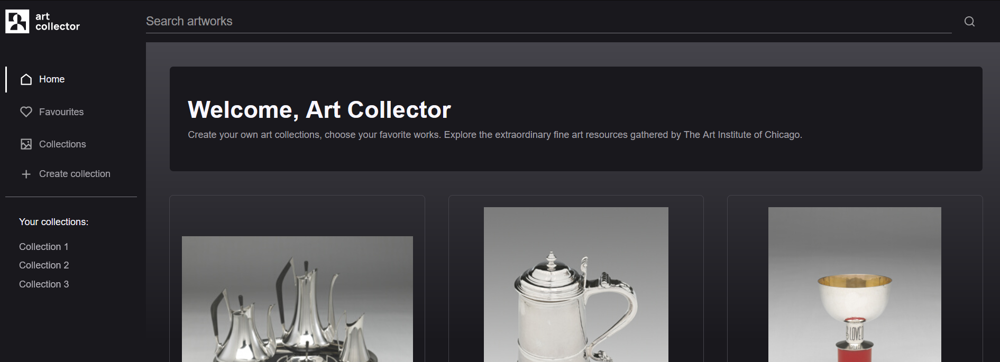

# Art Collector - Create art collections

Create your own art collections, choose your favorite works. Explore the extraordinary fine art resources gathered by [The Art Institute of Chicago](https://www.artic.edu/).

[See the app live.](https://artic-art-collector.netlify.app/)

## Table of Contents

- [General info](#general-info)
- [Setup](#setup)
- [Features](#features)
- [Design](#design)
- [Technologies](#technologies)
- [Code details and challenges](#code-details-and-challenges)
- [Possible improvements](#possible-improvements)
- [Acknowledgements](#acknowledgements)
- [Contact](#contact)

## General Info

Art Collector is a Single Page Application created to practice the use of the React.js library and other libraries from its ecosystem. The idea of the application is based on creating the artworks browser with the possibility of adding to the custom collection or the favorites list. Application functionalities are similar to the [Pinterest](https://pinterest.com). Artwork data is provided by the [Art Institute of Chicago API](http://api.artic.edu).

The project was an opportunity to learn deeper SPA design concepts in React, such as cross-application state management, custom hooks and routing. The code optimization and refactoring process was supported by AI tools.

## Setup

The project uses [Node](https://nodejs.org/en/) and [NPM](https://www.npmjs.com/). To run the app on your machine you should install all dependencies. Then create a developer build on a localhost port and run your web explorer.

Clone repository

```
git clone https://github.com/M-Mikos/art-collector.git
```

Install dependencies

```
npm i
```

Go live with developer build

```
npm run dev
```

Art Collector is ready at port 5173.

```
localhost:5173/
```

## Features

- Search for works from the collection of the Art Institute of Chicago
- View details of selected artwork with lightbox image
- Add the artwork to your favorites list
- Create, display, update and delete art collections
- Add a description to the collection
- Remove selected artwork from the collection
- Pop-up notification system
- Artworks list infinite scroll
- Storing collection data and favorites list in the user's local storage

## Design

The project uses light and subtle graphic means, the layout and style of which are inspired by the [Spotify](https://open.spotify.com/) application. The design was made in a dark theme complemented by delicate light accents and a discreet interface. The goal is to highlight the main content - a work of art. The application interface is responsive, with a separate layout prepared for mobile devices.

### Selected screens

| Search page (desktop)                                                                      | Search page (mobile)                                                                     |
| ------------------------------------------------------------------------------------------ | ---------------------------------------------------------------------------------------- |
| 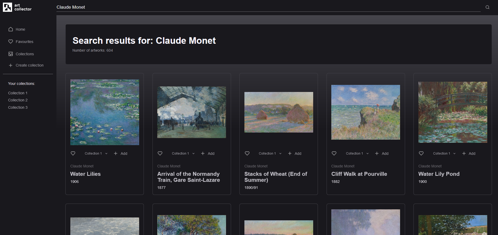 | 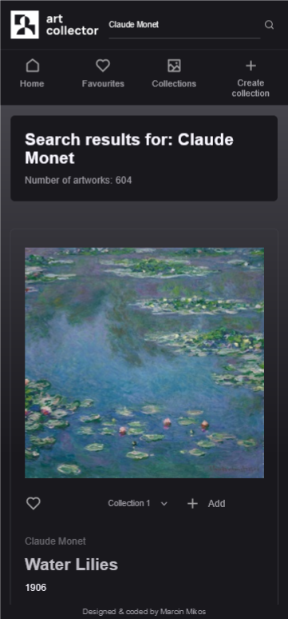 |

| Artwork Page                                                       | Collections list                                                                | 404 error page                                                   |
| ------------------------------------------------------------------ | ------------------------------------------------------------------------------- | ---------------------------------------------------------------- |
| 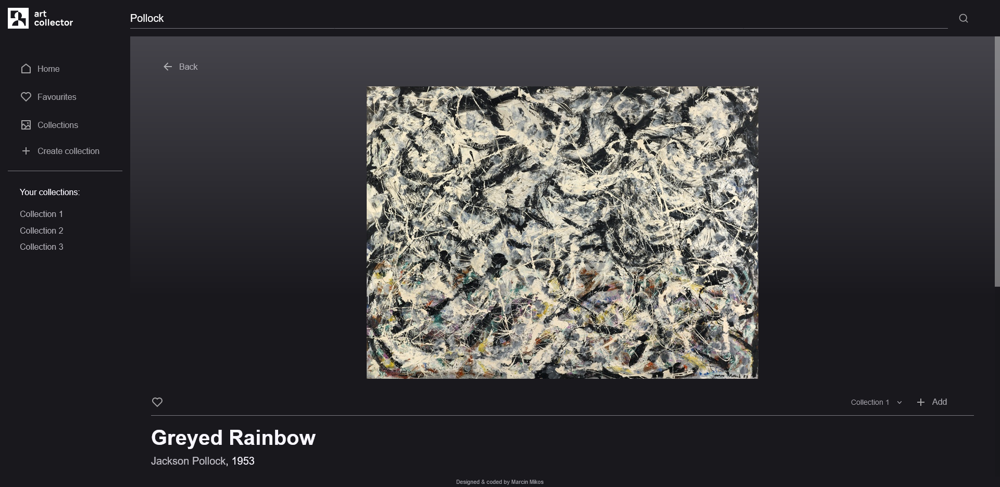 | 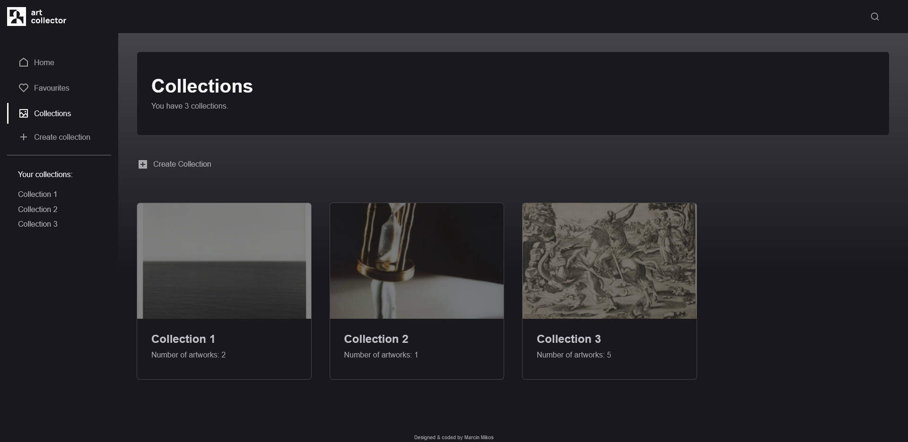 | 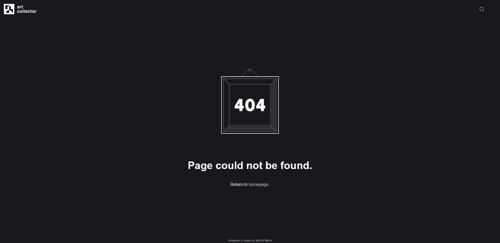 |

### Graphic elements

The Art Collector logo and 404 error handling page illustration are self-prepared. Project includes icons from [Remix Icon](https://remixicon.com/) library.

## Technologies

The technologies used and selected resolved technical issues of the Art Collector application are listed below. For more detailed solutions description check documentation in application files.

- [Vite](https://vitejs.dev/) - Setting up dev environment
- [React.js](https://react.dev/)
- [React Router](https://reactrouter.com/en/main) - Page routing and preloading data
- [React Redux](https://react-redux.js.org/) - State container for managing collections and favourites lists
  - [Redux Toolkit](https://redux-toolkit.js.org/)
- [Axios](https://axios-http.com/) - Simplifying fetching process
- [React Developer Tools](https://react.dev/learn/react-developer-tools) - Performance measurement
- CSS modules

## Code details and challenges

### Infinite scroll

The application uses a custom infinite scroll solution for dynamic load of additional artworks in the `<ArtworkList>` component. The infinite scroll effect is triggered when the user reaches the bottom of the `<RootLayout>` component. Additional dependencies check whether the search term contains more pages, whether all works have been loaded, and whether loading is currently in progress.

Information about reaching the bottom of the application is stored in the `onBottom` property in the React Redux UI slice. This allows the `<ArtworkList>` component to read it as a dependency for loading new results. Loading is handled by its own hook, `useMoreSearchResults()`, which takes the currently loaded results and returns the `loadMore()` function along with the remaining dependencies.

Here is `useMoreSearchResults()` custom hook code:

```javascript
function useLoadMoreSearchResults(prevItems, searchParams) {
  const [items, setItems] = useState(prevItems);
  const [nextPageNumber, setNextPageNumber] = useState(2);
  const [loading, setLoading] = useState(false);
  const [errorMessage, setErrorMessage] = useState("");

  useEffect(() => {
    setItems(prevItems);
  }, [prevItems]);

  const loadItems = async (pageNumber) => {
    try {
      setLoading(true);

      // Get items list
      const list = await artworksAPI.get(
        `/search?${searchParams}&page=${pageNumber}`
      );

      const prevItemsIDs = prevItems.map((item) => item.id);
      const newItemsIDs = list.data.data.map((item) => item.id);

      // Remove duplicated items
      const uniqueNewItemsIDs = newItemsIDs.filter(
        (newItemID) =>
          !prevItemsIDs.find((prevItemID) => prevItemID === newItemID)
      );

      // Get items details
      const newItems = await getArtworksById(uniqueNewItemsIDs);

      // Update items state
      setItems((prevItems) => [...prevItems, ...newItems]);

      // Check for last page
      const totalPages = list.data.pagination.total_pages;

      pageNumber !== totalPages
        ? setNextPageNumber((pageNumber) => pageNumber + 1)
        : setNextPageNumber(null);

      setLoading(false);
      setErrorMessage("");
    } catch (error) {
      setErrorMessage(error.message);
      setLoading(false);
    }
  };

  return [items, loadItems, nextPageNumber, loading, errorMessage];
}
```

The `loadMore()` function is called inside the `useEffect` hook when the `onBottom` dependency changes and other conditions are met.

The function call in the `<ArtworkList>` component is wrapped in a `debounce()` helper function to avoid too frequent API requests.

A problem resulting from the nature of the API providing resources was multiple uploads of content with the same ID. This caused duplicate key errors in the list of rendered components. To prevent this, the `loadMore()` function filters new results whose id already exists in the list.

> **Note:** Warnings about duplicate list keys (_"Warning: Encountered two children with the same key..."_) may occur in the developer build. These are due to double rendering of the art list component caused by strict mode. To disable strict mode, remove the `<React.StrictMode>` tag surrounding the `<App>` tag in the `main.jsx` file.

### Popup Notifications

After dispatching actions like adding artwork to the favourites list or creating a new collection, the user receives confirmation in the form of a notification prompt. Notification state is managed by the custom hook, which returns `showNotification()` function. Hook controls notification timeout and prevents notification stacking.

For a better user experience, the notification component is not tied to a specific path, but uses the `createPortal()` functions to move the component to a separate root node to render it regardless of the changing application path. Therefore, information about the content of the notification is retained inside the React Redux UI slice to be easily accessible in component usage.

### Loading data

Artworks data used in application is provided by [Artic API](http://api.artic.edu/docs/). API passes data in `.JSON` format. Application utilizes Axios library to simplify the fetching data process. Data is accessed via API endpoints.

Example request:

```
https://api.artic.edu/api/v1/artworks/search?q=cats
```

The processing of the received data has been abstracted into three helper functions `getArtworksById()`, `loadArtworksFromCollection()` and `loadArtworksFromFavourites()`. These functions, together with the React Router loader functions corresponding to each path, provide appropriate data as well as handle errors and notifications.

### Refactoring

For better structure and readability, the code has been refactored. In this process, AI solution was utilized (OpenAI's [ChatGPT 3.5](https://chat.openai.com))

### Optimization

The main goal when optimizing the application was to identify and remove the most costly re-rendering processes. To find them, the Profiler available in React Developer Tools was used.The code has been optimized using the `memo()` function on high-level layout components and `<ArtworkThumbnail>` components.

Performance has been measured by the action of removing an artwork from the favorites list (on the `/favorites` path). The process consisted of three steps:

1. Displaying popup notification,
2. Updating content of `<TitleBanner>` component (favourites count),
3. Removing `<ArtworkThumbnail>` component from `<ArtworkList>` parent component.

As a result of optimization, the code execution time was reduced from a total of 35ms to 18ms. The number of renders made by the application has been significantly reduced. The measurement results from the Profiler (before and after code optimization) are presented below:

| Step 1 before the optimization                                                | Step 1 after the optimization                                                   |
| ----------------------------------------------------------------------------- | ------------------------------------------------------------------------------- |
| 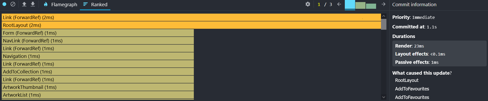 | 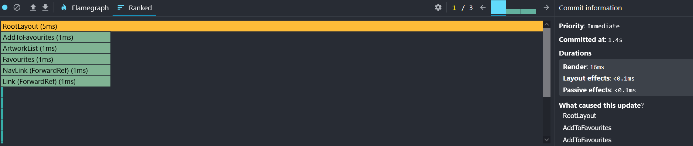 |

| Step 2 before the optimization                                                | Step 2 after the optimization                                                   |
| ----------------------------------------------------------------------------- | ------------------------------------------------------------------------------- |
| 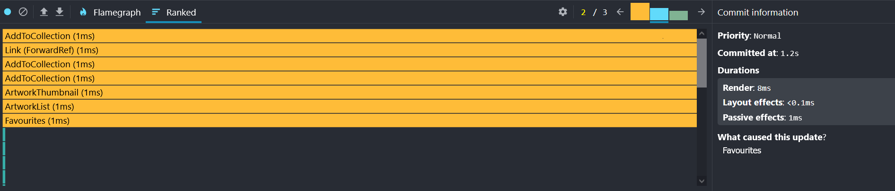 | 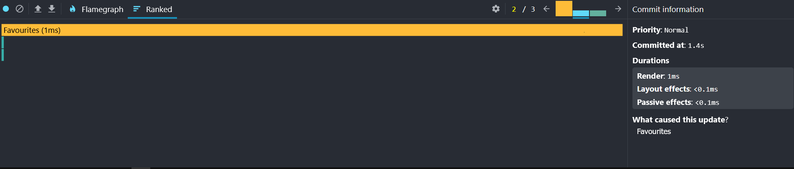 |

| Step 3 before the optimization                                                | Step 3 after the optimization                                                   |
| ----------------------------------------------------------------------------- | ------------------------------------------------------------------------------- |
| 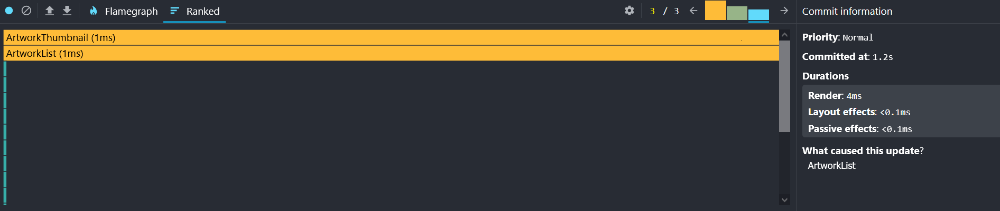 |  |

Other optimization methods were not found to be significantly beneficial. Since the application does not repeatedly perform complex calculations, there would be no benefit from using the `useMemo()` hook.

Unoptimized code repository is avaliable in _"Start optimizing"_ commit. Optimized code repository is available in _"Optimized RootLayout and ArtworkList (prevent unnecessary rerenders)"_.

### Configuration

To prevent repetition and improve code maintainability, application configuration data is not hard-coded but is stored in separate variables. Variables values can be set in `config.js` file. The configuration file contains API configuration, notifications and error messages, selected application text content, and other settings (e.g. timeout for notifications auto-hide).

## Possible improvements

- Code
  - Modification of components to obtain a clean structure of container and presentation components
  - Storing loader data with the provider (React Context) in the scope of a particular page, in order to reduce prop-drilling
  - Further refactoring of too complex components (e.g. `AddToCollection.jsx`)
  - Restructuring notification custom hook for keeping state in one place and better reusability. Create new hooks to abstract implementation details.
- Features
  - more detailed search (specific author, technique, etc.)
  - filtering artworks list
  - sorting artworks list

## Acknowledgements

### Useful resources

- _React - The Complete Guide 2023 (incl. React Router & Redux)_ - by Maximilian Schwarzmüller

### Artworks Data

- Provider
  - [The Art Insitute of Chicago](https://www.artic.edu/)
- API
  - [Art Institute of Chicago API](http://api.artic.edu)
- Licence
  - The provided data is licensed under a Creative Commons Zero (CC0) 1.0 designation and the Terms and Conditions of artic.edu (opens new window).

### Assets

- [Remix Icon](https://remixicon.com/)

## Contact

Design & code by [Marcin Mikos](mailto:mikos.marcin.m@gmail.com) - feel free to contact me!
